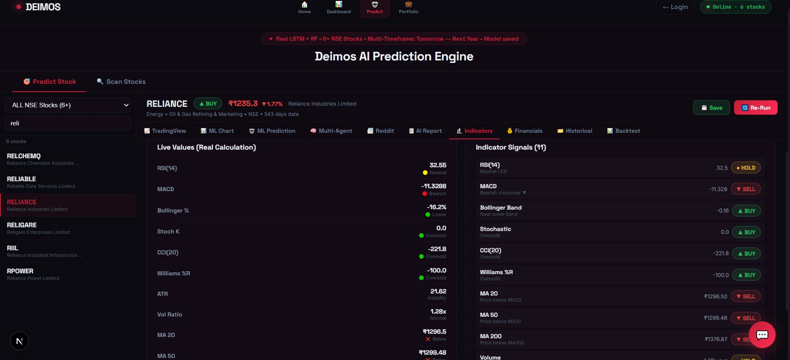
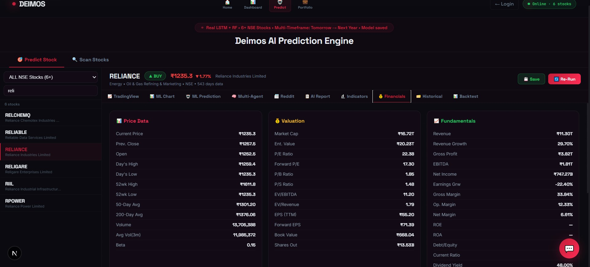
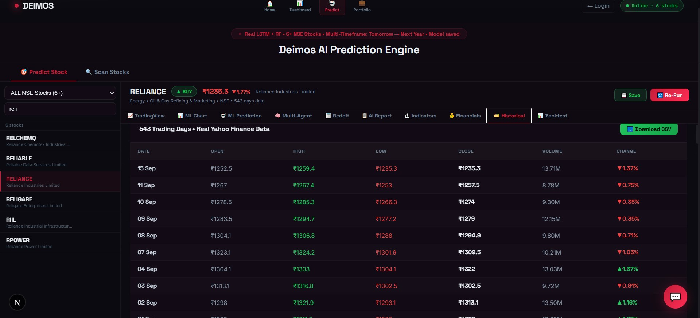
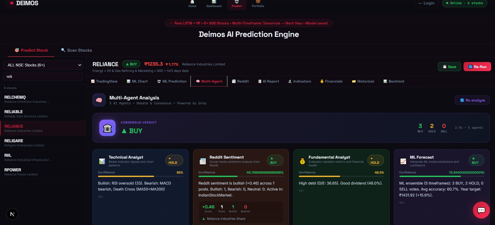
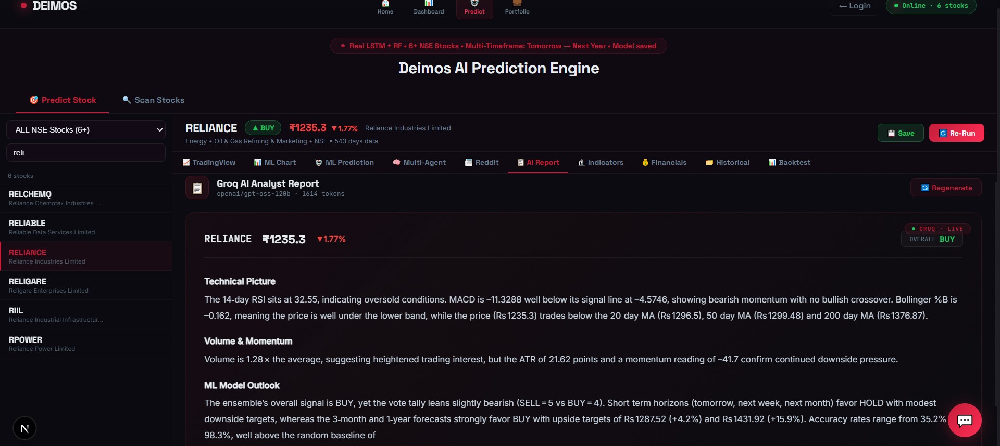

# 🚀 Deimos — AI-Powered Stock Market Intelligence Platform

A full-stack **AI stock market prediction and analysis platform** for NSE (National Stock Exchange of India) stocks. Built with **Next.js**, **Flask**, and **Machine Learning** models including LSTM, XGBoost, LightGBM, and Random Forest ensemble.


---

## 📸 Screenshots

### ML Prediction Chart & Price Forecast


### Technical Indicators Dashboard


### Financial Analysis


### Historical Performance


### Multi-Agent AI Analysis (5 Agents Debate)


### AI-Generated Report


### AI Live Chat


---

## ✨ Features

### 🎯 Multi-Timeframe ML Predictions
- **5 Timeframes**: Tomorrow, Next Week, Next Month, Next 3 Months, Next Year
- **Ensemble Models**: LSTM + XGBoost + LightGBM + Random Forest
- **GARCH Volatility**: Statistical volatility modeling for confidence intervals
- **Bull/Bear Targets**: Price ranges with 75th/25th percentile projections

### 🤖 AI-Powered Live Chat
- **Natural Language Queries**: Ask "Should I buy Reliance?" and get data-backed answers
- **8 Built-in Tools**: Stock quotes, financials, technical indicators, price history, comparisons, web search, Reddit sentiment, ML predictions
- **Real-Time Data**: Fetches live NSE data for every response
- **Powered by Groq**: Fast LLM inference using Groq's API

### 📊 Technical Analysis
- **15+ Indicators**: RSI, MACD, Bollinger Bands, Stochastic, CCI, Williams %R, ATR, Moving Averages (20/50/200)
- **Buy/Sell Signals**: Automated signal generation from indicator consensus
- **Interactive Charts**: 30-day price forecast visualization

### 🕵️ Multi-Agent Analysis
- **5 Specialized AI Agents**: Technical Analyst, Reddit Sentiment, Fundamental Analyst, ML Forecast, Risk Manager
- **Consensus Debate**: Agents debate and produce a unified verdict
- **LLM-Powered Synthesis**: Groq AI synthesizes all agent reports into an actionable investment decision

### 📰 Reddit Sentiment Analysis
- **Real Data**: Scrapes r/IndianStockMarket, r/IndianStreetBets, r/DalalStreetBets
- **NLP Sentiment Scoring**: AI-powered bullish/bearish/neutral classification
- **Live Social Buzz**: See what retail investors are saying about any stock

### 💼 Portfolio Tracking
- **Supabase Auth**: User accounts with email/password authentication
- **Watchlist**: Save and track favorite stocks
- **Prediction History**: Save predictions to MSSQL database for backtesting

### 🔍 Stock Scanner
- **Volatile Stock Scanner**: Scan 100 most volatile NSE stocks
- **Batch Analysis**: Run ML predictions on multiple stocks simultaneously
- **Signal Filtering**: Filter by BUY/SELL/HOLD signals

---

## 🏗️ Architecture

```
┌─────────────────────────────────────────────────────┐
│                   FRONTEND (Next.js 15)              │
│  ┌──────────┐ ┌──────────┐ ┌──────────┐ ┌────────┐ │
│  │ Predict  │ │Dashboard │ │Portfolio │ │  Chat  │ │
│  │  Page    │ │  Page    │ │  Page    │ │  (AI)  │ │
│  └────┬─────┘ └────┬─────┘ └────┬─────┘ └───┬────┘ │
│       │             │            │            │      │
│  ┌────┴─────────────┴────────────┴────────────┴────┐ │
│  │              API Routes (Next.js)                │ │
│  │  /api/chat  /api/groq-report/[symbol]           │ │
│  └──────────────────┬──────────────────────────────┘ │
└─────────────────────┼───────────────────────────────┘
                      │ HTTP
┌─────────────────────┼───────────────────────────────┐
│              BACKEND (Flask Python)                  │
│  ┌──────────┐ ┌──────────┐ ┌──────────────────────┐ │
│  │ yfinance │ │   ML     │ │   Multi-Agent        │ │
│  │ NSE Data │ │ Pipeline │ │   Analysis Engine    │ │
│  └──────────┘ └──────────┘ └──────────────────────┘ │
│  ┌──────────┐ ┌──────────┐ ┌──────────────────────┐ │
│  │  Reddit  │ │ Finance  │ │   MSSQL Database     │ │
│  │Sentiment │ │   NLP    │ │   (Predictions DB)   │ │
│  └──────────┘ └──────────┘ └──────────────────────┘ │
└─────────────────────────────────────────────────────┘
```

---

## 🛠️ Tech Stack

| Layer | Technology |
|-------|-----------|
| **Frontend** | Next.js 15, React, CSS |
| **Backend** | Flask 3, Python 3.10+ |
| **ML Models** | LSTM (Keras), XGBoost, LightGBM, Random Forest (scikit-learn) |
| **Volatility** | GARCH (arch library) |
| **Data Source** | yfinance (Yahoo Finance / NSE) |
| **Database** | MSSQL Server (predictions storage) |
| **Auth** | Supabase (email/password) |
| **AI Chat** | Groq API (LLM inference) |
| **Sentiment** | Reddit Public JSON API + NLP |
| **Styling** | Custom CSS with glassmorphism design |

---

## 📦 Installation

### Prerequisites
- **Node.js** 18+ and npm
- **Python** 3.10+
- **SQL Server Express** (optional, for saving predictions)
- **Groq API Key** (free at [console.groq.com](https://console.groq.com/keys))

### 1. Clone the Repository
```bash
git clone https://github.com/ameyasabale/stock_markey_prediction.git
cd stock_markey_prediction
```

### 2. Setup Flask Backend
```bash
cd flask_v3
pip install -r requirements.txt
python app.py
```
Flask runs on `http://localhost:5000`

### 3. Setup Next.js Frontend
```bash
cd nextjs_sidebyside
npm install
```

Create `.env.local` from the template:
```bash
cp .env.example .env.local
# Edit .env.local and add your API keys
```

Start the development server:
```bash
npm run dev
```
App runs on `http://localhost:3000`

### 4. Database Setup (Optional)
If you want to save predictions to MSSQL:
```bash
# Run the SQL setup script in SQL Server Management Studio
# File: flask_v3/mssql_setup.sql
```

---

## 📁 Project Structure

```
├── flask_v3/                    # Flask Backend
│   ├── app.py                   # Main API server (3000+ lines)
│   ├── multi_agent.py           # 5 AI agents + orchestrator
│   ├── reddit_sentiment.py      # Reddit scraper + NLP sentiment
│   ├── finance_nlp.py           # Financial NLP analysis
│   ├── earnings_model.py        # Earnings prediction model
│   ├── macro_indicators.py      # Macro economic indicators
│   ├── options_flow.py          # Options flow analysis
│   ├── backtesting.py           # Strategy backtesting
│   ├── db_save.py               # MSSQL save/retrieve
│   ├── db_auth.py               # Database authentication
│   ├── db_hourly.py             # Hourly predictions scheduler
│   └── requirements.txt         # Python dependencies
│
├── nextjs_sidebyside/           # Next.js Frontend
│   ├── app/
│   │   ├── predict/page.js      # Main prediction UI
│   │   ├── dashboard/page.js    # Dashboard
│   │   ├── portfolio/page.js    # Portfolio tracker
│   │   ├── login/               # Login page
│   │   ├── signup/              # Signup page
│   │   └── api/
│   │       ├── chat/route.js    # AI chat endpoint
│   │       └── groq-report/     # AI report generator
│   ├── components/
│   │   ├── DeimosNav.js         # Navigation bar
│   │   └── HomePage.js          # Landing page
│   ├── lib/                     # Supabase client
│   ├── .env.example             # Environment template
│   └── package.json
│
├── screenshots/                 # App screenshots
└── .gitignore
```

---

## 🔑 API Endpoints

| Endpoint | Method | Description |
|----------|--------|-------------|
| `/api/predict/<symbol>` | GET | Run ML prediction for a stock |
| `/api/stock/overview/<symbol>` | GET | Get stock overview + indicators |
| `/api/stock/history/<symbol>` | GET | Get price history |
| `/api/multi-agent-analysis/<symbol>` | POST | Run 5-agent analysis |
| `/api/reddit-sentiment/<symbol>` | GET | Get Reddit sentiment |
| `/api/prediction/save` | POST | Save prediction to DB |
| `/api/prediction/history/<symbol>` | GET | Get prediction history |
| `/api/volatile/scan` | GET | Scan volatile stocks |

---

## 🎓 What I Learned

- Building end-to-end ML pipelines with ensemble models
- Full-stack development with Next.js + Flask
- Integrating LLMs (Groq) for conversational AI with tool calling
- Multi-agent AI architecture for collaborative analysis
- Working with financial data APIs and technical indicators
- Real-time web scraping for sentiment analysis
- Database design with MSSQL for time-series predictions

---

## ⚠️ Disclaimer

This project is built for **educational purposes only**. The predictions and analysis generated are based on historical data and machine learning models, which are inherently uncertain. **This is NOT financial advice.** Always consult a SEBI-registered financial advisor before making investment decisions.

---

## 📝 License

This project is licensed under the MIT License — see the [LICENSE](LICENSE) file for details.

---

## 👨‍💻 Author

**Ameya Sabale**
- GitHub: [@ameyasabale](https://github.com/ameyasabale)

---

*Built with ❤️ using Next.js, Flask, and Machine Learning*
